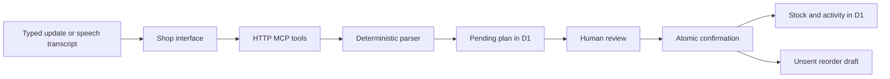

# Architecture

## Identity and persistence

Sites authenticates the viewer and supplies `oai-authenticated-user-id`. This identity scopes every shop query. Incoming Origin must match the app origin. Private API responses use `Cache-Control: no-store`.

The localhost-only fallback is for development. Other hosting environments must authenticate requests and strip untrusted identity headers before supplying a verified identity. Never expose the trusted header directly to the internet. Sites browser sign-in is not a ready-made authentication integration for external Alexa clients.

Five D1 tables hold shop revisions, stock, plans, activity, and drafts. Catalog descriptions and sample prices are source controlled; quantities are durable database state. A shop is seeded only when first loaded. Browser storage is not used as a database.

## Review and concurrency

A plan captures the current shop revision. Confirmation claims it only when pending, unexpired, owned by the viewer, and based on the current revision. The claim, quantity changes, history, revision increment, and final status share one atomic D1 batch. Every effect depends on that claim. An applied plan returns its result without repeating the mutation.

MCP can read or prepare; it exposes no confirmation tool. The browser's review button calls `/api/review`, requiring the authenticated shop, same origin, JSON, and `X-Duka-Review: 1`. The header is a request-origin defense, not a secret or substitute for authentication.

Draft CSV downloads check ownership. No email, payment, supplier API, or automatic order dispatch exists.

## Voice

SpeechRecognition captures a short English phrase and places its transcript in the input without submitting it. Speech synthesis can read the response. The deterministic parser supports constrained phrases and product aliases; it is not an LLM. Unknown products, unsupported phrases, fractions, negative stock, and unreasonable quantities are rejected.

A future model should call these same narrow tools rather than write SQL or bypass review.

## Next engineering work

1. Test microphone behavior and product pronunciation with a willing shopkeeper.
2. Add catalog editing and aliases based on observed needs.
3. Implement supported external MCP authentication and review handoff, then test an Alexa+ client.
4. Evaluate any broader language layer on consented, de-identified commands.
5. Add expired-plan retention and merchant backup/export before production use.
